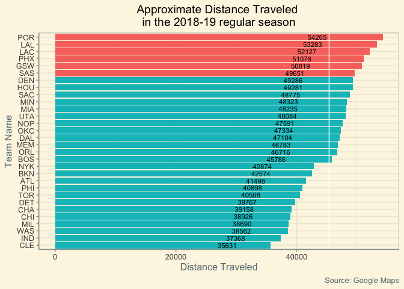

distances nba
================
Lewis Pipkin
7/10/2019

``` r
library(tidyverse)
```

    ## ── Attaching packages ───────────────────────────────── tidyverse 1.2.1 ──

    ## ✔ ggplot2 3.2.0     ✔ purrr   0.3.2
    ## ✔ tibble  2.1.3     ✔ dplyr   0.8.3
    ## ✔ tidyr   0.8.3     ✔ stringr 1.4.0
    ## ✔ readr   1.3.1     ✔ forcats 0.4.0

    ## ── Conflicts ──────────────────────────────────── tidyverse_conflicts() ──
    ## ✖ dplyr::filter() masks stats::filter()
    ## ✖ dplyr::lag()    masks stats::lag()

``` r
library(ggthemes)

coords=data.frame(
  MEMlat=35.138022, MEMlong=-90.050512,
  ATLlat=33.757253, ATLlong=-84.396314,
  WASlat=38.898197, WASlong=-77.020062,
  DENlat=39.748577, DENlong=-105.006669,
  GSWlat=37.770358, GSWlong=-122.386905,
  LAClat=34.042849, LAClong=-118.266557,
  LALlat=34.042849, LALlong=-118.266557,
  SAClat=38.580434, SAClong=-121.498840,
  PORlat=45.531834, PORlong=-122.667758,
  NOPlat=29.949325, NOPlong=-90.082739,
  SASlat=29.427512, SASlong=-98.438185,
  HOUlat=29.684815, HOUlong=-95.411201,
  MIAlat=25.781392, MIAlong=-80.187237,
  DALlat=32.790189, DALlong=-96.810847,
  OKClat=35.463085, OKClong=-97.515289,
  PHXlat=33.445261, PHXlong=-112.071736,
  MILlat=43.045119, MILlong=-87.916244,
  MINlat=44.979153, MINlong=-93.275585,
  CHIlat=41.881280, CHIlong=-87.674384,
  CLElat=41.496209, CLElong=-81.688835,
  NYKlat=40.750915, NYKlong=-73.992859,
  BKNlat=40.682693, BKNlong=-73.975588,
  BOSlat=42.366079, BOSlong=-71.061652,
  CHAlat=35.225142, CHAlong=-80.839434,
  UTAlat=40.768386, UTAlong=-111.900234,
  ORLlat=28.539155, ORLlong=-81.383124,
  TORlat=43.643709, TORlong=-79.378337,
  DETlat=42.340972, DETlong=-83.056003,
  PHIlat=39.901070, PHIlong=-75.171242,
  INDlat=39.763899, INDlong=-86.155649
)

haversine.mi=function(tm1,tm2){
  coords %>% dplyr::select(starts_with(tm1),starts_with(tm2)) -> x
  r=6371
  phi1 = x[1,1] 
  phi2 = x[1,3]
  lambda1 = x[1,2]
  lambda2 = x[1,4]
  
  if(tm1==tm2){
    0
  } else {
    acos(cos(pi/180*(90-phi1)) *cos(pi/180*(90-phi2)) +sin(pi/180*(90-phi1)) *sin(pi/180*(90-phi2)) *cos(pi/180*(lambda1-lambda2))) *3958.756
  }
}


haversine.mi('ATL','DET')
```

    ## [1] 597.5207

``` r
haversine.mi('ATL','MEM')
```

    ## [1] 335.932

``` r
coords %>% dplyr::select(ends_with("lat")) %>% names() %>% str_extract(".+(?=lat)") %>% sort() -> team_abbr

team_dist <- matrix(rep(0,30*30),nrow=30,ncol=30)
rownames(team_dist) <- team_abbr
colnames(team_dist) <- team_abbr
for(i in 1:30){
  for(j in 1:30){
    team_dist[i,j] <- haversine.mi(rownames(team_dist)[i],colnames(team_dist)[j])
  }
}

# write.csv(team_dist,"distances_bw_teams.csv")

nbastatR::current_schedule() -> sched
```

    ## Warning: replacing previous import 'dplyr::collapse' by 'glue::collapse'
    ## when loading 'nbastatR'

    ## Warning: replacing previous import 'curl::handle_reset' by
    ## 'httr::handle_reset' when loading 'nbastatR'

    ## Warning: replacing previous import 'dplyr::intersect' by
    ## 'lubridate::intersect' when loading 'nbastatR'

    ## Warning: replacing previous import 'dplyr::union' by 'lubridate::union'
    ## when loading 'nbastatR'

    ## Warning: replacing previous import 'dplyr::setdiff' by 'lubridate::setdiff'
    ## when loading 'nbastatR'

    ## Warning: replacing previous import 'httr::timeout' by 'memoise::timeout'
    ## when loading 'nbastatR'

    ## Warning: replacing previous import 'magrittr::set_names' by
    ## 'purrr::set_names' when loading 'nbastatR'

    ## Warning: replacing previous import 'jsonlite::flatten' by 'purrr::flatten'
    ## when loading 'nbastatR'

    ## Warning: replacing previous import 'curl::parse_date' by
    ## 'readr::parse_date' when loading 'nbastatR'

    ## Warning: replacing previous import 'purrr::list_along' by
    ## 'rlang::list_along' when loading 'nbastatR'

    ## Warning: replacing previous import 'purrr::invoke' by 'rlang::invoke' when
    ## loading 'nbastatR'

    ## Warning: replacing previous import 'purrr::flatten_raw' by
    ## 'rlang::flatten_raw' when loading 'nbastatR'

    ## Warning: replacing previous import 'purrr::modify' by 'rlang::modify' when
    ## loading 'nbastatR'

    ## Warning: replacing previous import 'purrr::as_function' by
    ## 'rlang::as_function' when loading 'nbastatR'

    ## Warning: replacing previous import 'purrr::flatten_dbl' by
    ## 'rlang::flatten_dbl' when loading 'nbastatR'

    ## Warning: replacing previous import 'jsonlite::unbox' by 'rlang::unbox' when
    ## loading 'nbastatR'

    ## Warning: replacing previous import 'purrr::flatten_lgl' by
    ## 'rlang::flatten_lgl' when loading 'nbastatR'

    ## Warning: replacing previous import 'purrr::flatten_int' by
    ## 'rlang::flatten_int' when loading 'nbastatR'

    ## Warning: replacing previous import 'purrr::%@%' by 'rlang::%@%' when
    ## loading 'nbastatR'

    ## Warning: replacing previous import 'purrr::flatten_chr' by
    ## 'rlang::flatten_chr' when loading 'nbastatR'

    ## Warning: replacing previous import 'purrr::splice' by 'rlang::splice' when
    ## loading 'nbastatR'

    ## Warning: replacing previous import 'purrr::flatten' by 'rlang::flatten'
    ## when loading 'nbastatR'

    ## Warning: replacing previous import 'purrr::prepend' by 'rlang::prepend'
    ## when loading 'nbastatR'

    ## Warning: replacing previous import 'readr::guess_encoding' by
    ## 'rvest::guess_encoding' when loading 'nbastatR'

    ## Warning: replacing previous import 'purrr::pluck' by 'rvest::pluck' when
    ## loading 'nbastatR'

    ## Warning: replacing previous import 'magrittr::extract' by 'tidyr::extract'
    ## when loading 'nbastatR'

    ## Warning: replacing previous import 'rlang::as_list' by 'xml2::as_list' when
    ## loading 'nbastatR'

    ## Joining, by = "idTeamHome"

    ## Joining, by = "idTeamAway"

    ## Joining, by = "idRow"
    ## Joining, by = "idRow"
    ## Joining, by = "idRow"
    ## Joining, by = "idRow"

``` r
rs_sched <- sched %>%
  filter(str_sub(idGame,1,1)=='2') %>%
  dplyr::select(dateGame,slugTeamAway,slugTeamHome)

# rs_sched %>% filter(grepl("PHI",slugTeamHome))

sched_by_team <- function(team){
  rs_sched %>%
    filter(grepl(team,slugTeamHome)|grepl(team,slugTeamAway)) %>%
    dplyr::select(1,3)
}

# sched_by_team("BKN")

team_and_dist = data.frame()


ordered_table=function(x){
  table(x)[rev(order(table(x)))]
}

for(p in 1:length(team_abbr)){
  team <- team_abbr[p]
  sched_by_team(team) -> s
  ind <- as.Date("2018-12-25") %in% s$dateGame
  if(ind==T){
    s <- data.frame(rbind(data.frame(dateGame=as.Date('2018-10-10'),slugTeamHome=as.character(as.data.frame(ordered_table(s$slugTeamHome))[1,1])),
                          data.frame(dateGame=as.Date('2019-02-17'),slugTeamHome=as.character(as.data.frame(ordered_table(s$slugTeamHome))[1,1])),
                          s)) %>% arrange(dateGame)
  } else {
    s <- data.frame(rbind(data.frame(dateGame=as.Date('2018-10-10'),slugTeamHome=as.character(as.data.frame(ordered_table(s$slugTeamHome))[1,1])),
                          data.frame(dateGame=as.Date('2019-02-17'),slugTeamHome=as.character(as.data.frame(ordered_table(s$slugTeamHome))[1,1])),
                          data.frame(dateGame=as.Date('2018-12-25'),slugTeamHome=as.character(as.data.frame(ordered_table(s$slugTeamHome))[1,1])),
                          s)) %>% arrange(dateGame)
  }
  

    
  dist_counter <- 0
  for(i in 2:nrow(s)){
    dist_counter <- dist_counter + team_dist[as.character(s[i,2]),as.character(s[i-1,2])]
    # dist_log[i-1,team] <- dist_counter
  }
  team_and_dist[p,"Team Name"] <- team
  team_and_dist[p,"Distance Traveled"] <- dist_counter
}
team_and_dist$above <- team_and_dist$`Distance Traveled` <= quantile(team_and_dist$`Distance Traveled`,.8)

team_and_dist %>% ggplot(aes(x=reorder(`Team Name`,`Distance Traveled`),y=`Distance Traveled`,fill=above,label=round(`Distance Traveled`,0))) + 
  geom_bar(stat='identity') + 
  coord_flip() +
  theme_solarized() + 
  geom_hline(yintercept=mean(team_and_dist$`Distance Traveled`),color='white') +
  xlab("Team Name") +
  ggtitle("Approximate Distance Traveled \nin the 2018-19 regular season") + 
  theme(plot.title = element_text(color = "black",hjust = 0.5)) +
  theme(legend.position = "none") + 
  labs(caption="Source: Google Maps") +
  geom_text(size = 3, position = position_stack(vjust = 0.8))
```


